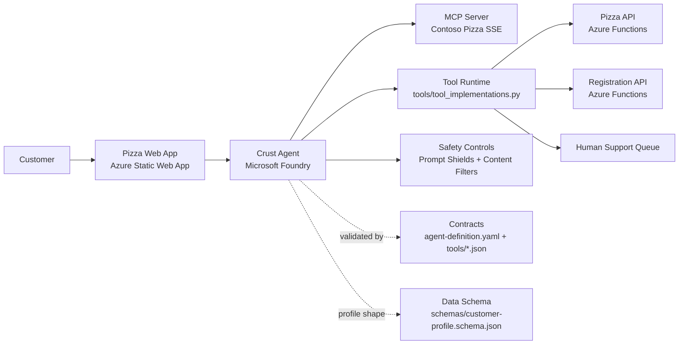
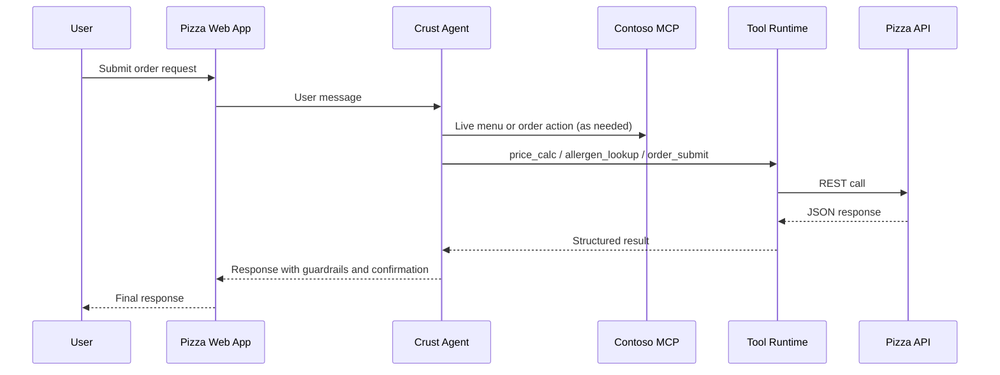

# Agent and App Architecture

This diagram reflects the current agent runtime shape defined by agent-definition.yaml, tools/tool_implementations.py, and config/deployment-config.yaml.

## System Diagram

## Runtime Notes

- MCP endpoint is the live ordering capability layer for menu, create order, status, and cancellation.
- Python tools call REST endpoints for menu/allergen/price/order/escalation operations.
- Safety controls are configured in the agent definition and applied before/around generation.
- Schema and tool contracts are enforced by validator scripts in tests/validators.

## Interaction Flow (High Level)

