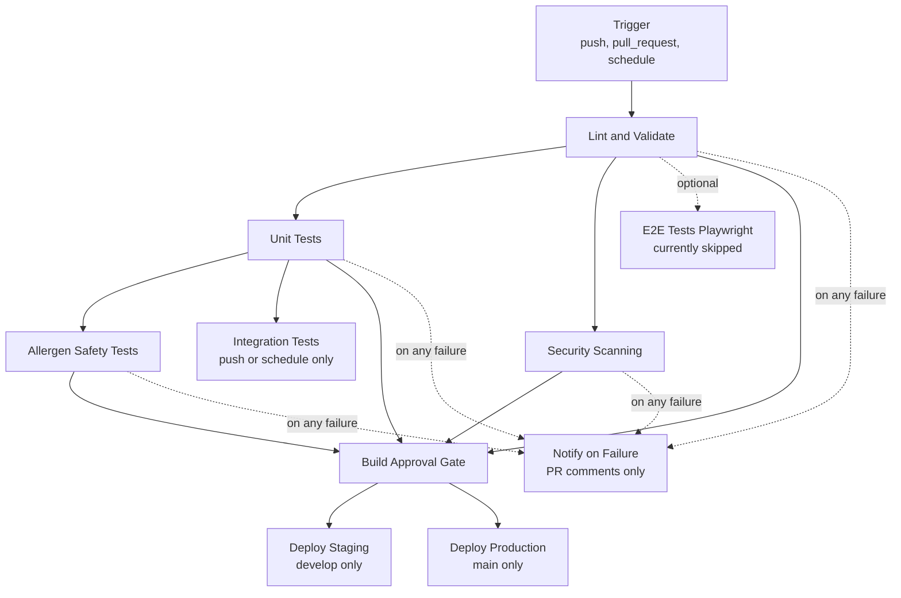

# Build Pipeline

This diagram mirrors the active pipeline in .github/workflows/ci.yaml.

## CI/CD Pipeline Diagram

## Job Summary

1. Lint and Validate

- Python and Node setup
- Dependency install
- make lint
- make validate
- formatting checks

2. Unit Tests

- pytest unit tests with coverage
- coverage upload and junit artifacts

3. Security Scanning

- Trivy scan and SARIF upload
- Semgrep static analysis
- Bandit scan
- dependency-check scan

4. Allergen Safety Tests

- guardrail test execution
- post-run verification script

5. Integration Tests

- runs only on push and schedule
- uses live API endpoint configuration

6. Deployments

- Staging deployment from develop branch
- Production deployment from main branch

## Current Pipeline Notes

- Playwright E2E job is intentionally disabled during stabilization.
- Notify on Failure posting is gated to pull_request events to avoid push-event issue comment failures.
