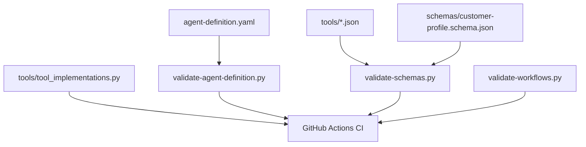

# Data Schemas and Tool Contracts

This page inventories the current schema and contract files that drive validation in tests/validators/validate-schemas.py.

## JSON Schema Inventory

| File                                 | Type        | Purpose                                                          |
| ------------------------------------ | ----------- | ---------------------------------------------------------------- |
| schemas/customer-profile.schema.json | Data schema | Long-term customer profile, consent, retention, and audit fields |

## Tool Contract Inventory

| File                               | Contract Type    | Used By                 |
| ---------------------------------- | ---------------- | ----------------------- |
| tools/menu_lookup.json             | Tool JSON schema | menu_lookup             |
| tools/allergen_lookup.json         | Tool JSON schema | allergen_lookup         |
| tools/price_calc.json              | Tool JSON schema | price_calc              |
| tools/pizza_quantity_estimate.json | Tool JSON schema | pizza_quantity_estimate |
| tools/order_submit.json            | Tool JSON schema | order_submit            |
| tools/order_status.json            | Tool JSON schema | order_status            |
| tools/human_handoff.json           | Tool JSON schema | human_handoff           |

## Validation Coverage

Schema and contract syntax validation is enforced by:

- tests/validators/validate-schemas.py

Agent-level structural validation is enforced by:

- tests/validators/validate-agent-definition.py

Workflow integrity validation is enforced by:

- tests/validators/validate-workflows.py

## Data and Contract Flow

## Maintenance Checklist

1. Add schema file and register it in tests/validators/validate-schemas.py.
2. Add or update tool contract JSON in tools/.
3. Keep tool implementation signatures aligned with contract definitions.
4. Run local validation before opening pull requests.
